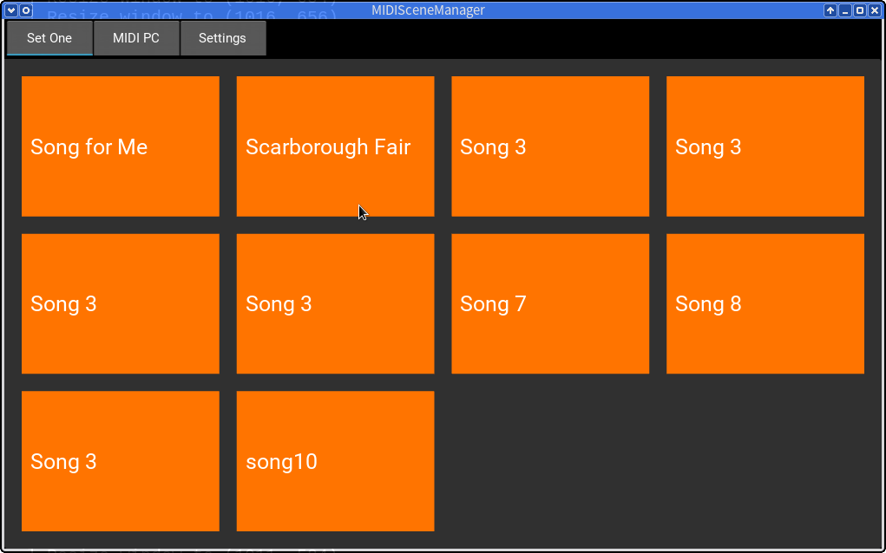

MIDISceneManager
================

Switch between setups of MIDI devices (scenes) with a press of a button.

Features
--------

* Unlimited panels of buttons for changing MIDI scenes
* Send a MIDI command or a sequence of commands when entering a scene
* Send a MIDI command or a sequence of commands when leaving a scene
* Each on own MIDI channel or on the default channel
* Add delays between commands
* Define order of panels and buttons
* Define number of buttons and grid columns per panel
* Define panel and button labels and colors
* Select and change MIDI output device easily

Requirements
------------

To run **MIDISceneManager** you need:

* `Python 3`_
* Kivy_
* python-rtmidi_

If you want to help with the development of the software, additional packages must be installed:

* pytest_ - implement readable tests without boilerplate-code
* pytest-cov_ - generate an HTML coverage report
* Sphinx_ - generate a readable HTML documentation
* Buildozer_ - deploy your app to an Android mobile device

Installation
------------

Clone the repository:

.. code-block:: bash

    $ git clone https://github.com/SpotlightKid/midiscenemanager.git
    $ cd midiscenemanager

Create a new virtual environment. Given that you are using virtualenvwrapper_:

.. code-block:: bash

    $ mkvirtualenv -a "$(pwd)" --site-packages midiscenemanager

.. note::
    If you prefer to set up a fully isolated environment, feel free to omit the ``--site-packages``
    option and install Kivy via pip.

    In most cases, though, it is much easier to use your systems `Kivy`_ package including all its
    dependencies such as `Cython`_ and various non-Python libraries.

Install the requirements:

.. code-block:: bash

    $ pip install -r requirements.txt

Install the app package in "editable" mode:

.. code-block:: bash

    $ pip install -e .

Usage
-----

Launch the app via:

.. code-block:: bash

    $ midiscenemanager

Run the test suite with pytest_:

.. code-block:: bash

    $ make test

Generate an HTML coverage report and open it:

.. code-block:: bash

    $ make coverage

Generate the HTML documentation with Sphinx_ and open it:

.. code-block:: bash

    $ make docs

Build an android apk with Buildozer_:

.. code-block:: bash

    $ make apk

Deploy the app to your android device with Buildozer_:

.. code-block:: bash

    $ make deploy

Authors
-------

**MIDISceneManager** was developed and is copyrighted by Christopher Arndt, 2017.

License
-------

Distributed under the terms of the `MIT license`_, **MIDISceneManager** is free and open source
software.

Issues
------

If you encounter any problems, please `file an issue`_ along with a detailed description.

.. _buildozer: https://github.com/kivy/buildozer
.. _cython: https://pypi.python.org/pypi/Cython
.. _file an issue: https://github.com/SpotlightKid/midiscenemanager/issues
.. _kivy: https://github.com/kivy/kivy
.. _mit License: http://opensource.org/licenses/MIT
.. _pytest-cov: https://pypi.python.org/pypi/pytest-cov
.. _pytest: http://pytest.org/latest/
.. _python 3: https://python.org
.. _python-rtmidi: https://github.com/SpotlightKid/python-rtmidi
.. _sphinx: http://sphinx-doc.org/
.. _virtualenvwrapper: https://virtualenvwrapper.readthedocs.org/en/latest/
